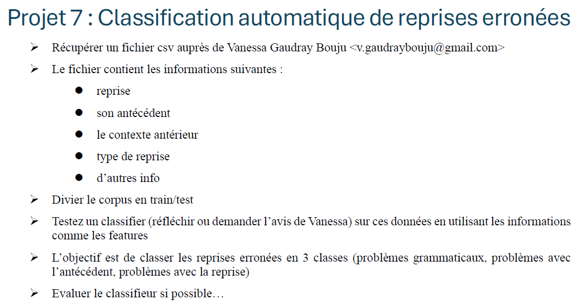

# Classification des reprises anaphoriques erronées
## Consignes


## Objectif
Ce projet est réalisé dans le cadre d'un travail de groupe (4 personnes) en Traitement du Langage Naturel (NLP) / Machine Learning. 

L'objectif principal est de **détecter et classer automatiquement des erreurs de reprises anaphoriques** dans des textes en français. À partir d'un jeu de données annoté, nous devons construire un pipeline de Machine Learning capable de classer ces erreurs en **3 grandes catégories (Target)** :
1. **Problèmes grammaticaux** (ex: erreurs d'accord en genre/nombre).
2. **Problèmes avec l'antécédent** (ex: antécédent flou, absent, ou trop de GN concurrents).
3. **Problèmes avec la reprise** (ex: mauvais choix du type de pronom).


## Structure du projet

```text
├── pipeline.py                      # Socle de base (matrice → prétraitement → baseline)
├── amelioration.py                  # Script avancé (optimisation GridSearchCV + feature importance)
├── visualisation.py                 # Module dédié à l'export du rapport HTML qualitatif
├── feature_engineering.py           # Script de Feature Engineering (extraction morphologique)
├── evaluation_features.py           # Évaluation de l'impact du feature engineering
├── dataset_erreurs_reprises.xlsx    # Jeu de données brut annoté
├── dataset_enrichi.xlsx             # Jeu de données enrichi avec les nouvelles variables
├── rapport.md                       # Rapport technique détaillé
├── requirements.txt                 # Dépendances Python
└── README.md
```

## Installation

```bash
python -m venv venv
source venv/bin/activate
pip install -r requirements.txt
```

## Utilisation

Le pipeline de Machine Learning a été conçu de manière modulaire en plusieurs grandes étapes :

### Étape 1 : Socle de base
```bash
python pipeline.py
```
Ce script pose les fondations du ML sur notre jeu de données :
1. **Construction de la matrice** : Chargement des données Excel et création de la variable cible (Grammaire, Antécédent, Reprise).
2. **Prétraitement** : Nettoyage des données manquantes, normalisation des distances et encodage (One-Hot) des variables catégorielles.
3. **Évaluation baseline** : Création d'une première version "brute" (sans réglages) de nos modèles pour obtenir un score point de départ de référence.

### Étape 2 : Optimisation et analyse
```bash
python amelioration.py
```
C'est le script d'investigation avancée qui fait appel aux fondations de l'étape 1 pour pousser l'analyse plus loin :
1. **Tuning (Recherche sur grille)** : Essai automatisé de dizaines de configurations différentes (hyperparamètres) pour trouver la version optimale de chaque algorithme.
2. **Interprétabilité** : Extraction des variables linguistiques qui influencent le plus les diagnostics de la machine (*Feature Importance*).
3. **Génération d'interface** : Création automatique d'un rapport visuel ergonomique (`analyse_erreurs.html`) exposant le texte, l'antécédent et la reprise pour analyser qualitativement à l'œil nu où la machine s'est trompée.

### Étape 3 : Feature Engineering
```bash
python feature_engineering.py
python evaluation_features.py
```
Ce module spécialisé enrichit considérablement les données avant modélisation :
1. **Extraction Morphologique** : Convertit le texte brut des pronoms en variables numériques structurées (ex: `elle` → Genre=F, Nombre=S).
2. **Accord** : Ajoute des colonnes évaluant la concordance morphologique (`Match_genre`, `Match_nombre`) entre l'antécédent et sa reprise.
3. **Gain de performance** : Le F1-score progresse de 0.34 à 0.55, avec une amélioration particulièrement marquée sur la classe « E grammaticale ».


## Plan d'action

### 1. Préparation des données

> **Consigne :** *Récupérer un fichier csv auprès de Vanessa Gaudray Bouju. Le fichier contient : la reprise, son antécédent, le contexte antérieur, le type de reprise, et d'autres infos. L'objectif est de classer les reprises erronées en 3 classes (problèmes grammaticaux, problèmes avec l'antécédent, problèmes avec la reprise).*
**Postulat** : chaque type d'erreur est corrélé à des variables spécifiques

- **Problèmes d'antécédent :** Le modèle se concentrera sur l'ambiguïté et l'éloignement (`GN_concurrents`, `GN_concurrents_compatibles`, `Distance_phrases`).
- **Problèmes de reprise :** Le modèle se concentrera sur la nature du mot et le sens (`Type_pronom`, `Definitude_GN`, `Similarite_reprise_antecedent`).
- **Problèmes grammaticaux :** Le modèle se concentrera sur la syntaxe (`Fonction_reprise`, `Fonction_antecedent`, `Distance_mots`).

**Action technique :** Nous utiliserons un `ColumnTransformer` (via Scikit-Learn) pour appliquer le One-Hot Encoding uniquement sur les variables catégorielles pertinentes, normaliser les distances, et exclure le texte brut de nos modèles de Machine Learning classiques.

Par conséquent, avant la modélisation, le jeu de données brut nécessite une mise en forme :
- **Création de la Target (Variable Cible) :** Regroupement (mapping) des annotations détaillées (`TypeErreur`, `SousTypeErreur`) pour former notre variable cible unique à 3 classes (Grammaire, Antécédent, Reprise).
- **Nettoyage :** Traitement des valeurs manquantes et exclusion des métadonnées inutiles.
- **Analyse Exploratoire (EDA) :** Étude de la distribution de la cible (vérification de l'équilibre des 3 classes) et observation des corrélations initiales.


### 2. Architecture

> **Consigne :** *Diviser le corpus en train/test.*

- **Split Train/Test :** Division du corpus en données d'entraînement et de test (en utilisant `stratify` pour conserver la proportion des 3 classes).
- **Prétraitement :** Mise en place d'un `ColumnTransformer` pour imputer, normaliser et encoder les variables selon leur type.

### 3. Modélisation

> **Consigne :** *Testez un classifier (réfléchir ou demander l'avis de Vanessa) sur ces données en utilisant les informations comme les features.*

- **Baseline :** Entraînement et évaluation croisée (5-fold) de Régression Logistique + Random Forest (via `pipeline.py`).
- **Sélection des features :** Extraction et analyse de l'importance des variables (Feature Importance) via le Random Forest optimisé, démontrant l'impact majeur des traits de distance (`Distance_caracteres`, `Distance_phrases`) et sémantiques.
- **Tuning :** Optimisation stricte des hyperparamètres par grille de recherche (`GridSearchCV`) maximisant le score F1-macro.

### 4. Évaluation

> **Consigne :** *Évaluer le classifieur si possible…*

- **Évaluation fine :** Génération des métriques de classification (Précision, Rappel, F1-Score par classe).
- **Matrice de confusion :** Création de la matrice de confusion pour visualiser les erreurs du modèle (dans la vue baseline).
- **Analyse des erreurs :** Export automatisé d'un rapport ergonomique HTML (`analyse_erreurs.html`) permettant l'exploration qualitative des phrases mal classées avec leur contexte, l'antécédent et la reprise surlignés.
- *(Bonus)* **Modèle de langage :** Tester un modèle de Deep Learning (type CamemBERT) utilisant uniquement le texte brut (`Contexte`).

---

## Répartition du travail

| Personne | Rôle | Tâche concrète |
|---|---|---|
| **1** | Architecture & Code | Pipeline complet (`pipeline.py`, `amelioration.py`, `visualisation.py`, `README.md`) |
| **2** | Feature Engineering | Tester différentes combinaisons de features (ablation study : retirer/ajouter des variables, comparer features numériques vs. catégorielles) |
| **3** | Comparaison de modèles | Tester d'autres classificateurs (SVM, Gradient Boosting…) et/ou d'autres critères d'arbre (`gini` vs. `entropy`) |
| **4** | Évaluation & Rapport | Comparer les métriques (`f1_macro`, `f1_weighted`, `balanced_accuracy`), analyser les erreurs qualitatives, rédiger discussion/conclusion/bibliographie |
